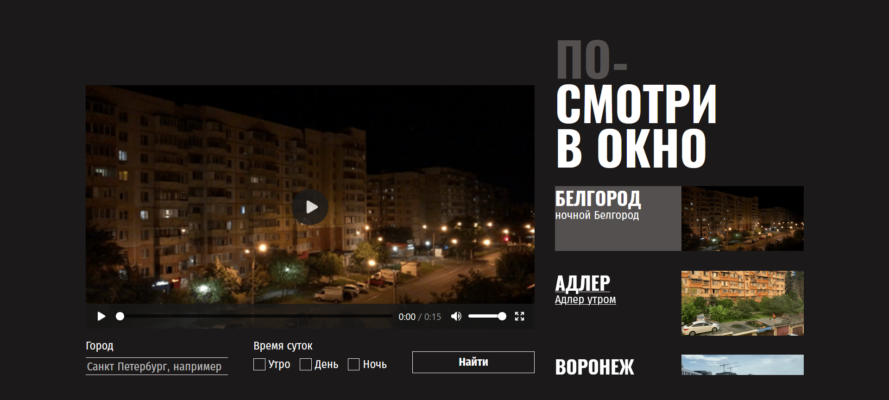
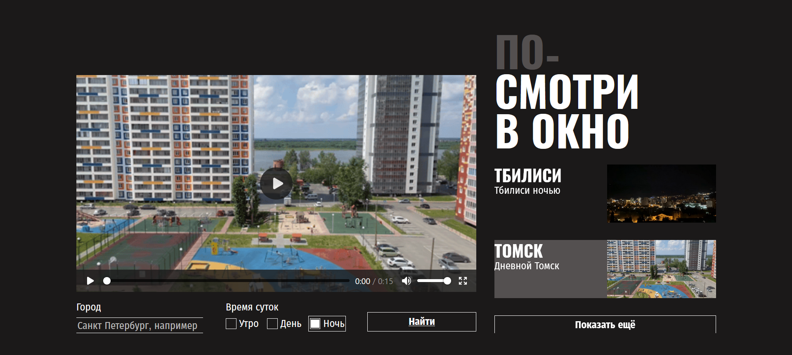

## Look outside - accessible landing page
**Description:** Second study project in my Frontend Developer course at Yandex.Practicum.  
Sprint 2 – "Accessibility and styling approaches."  
In this project, I focused on writing clean CSS for a pre-built HTML layout.

🔧 Stack: HTML5, CSS3 (flexbox, grid)  
🛠️ Tools: Figma, VS Code, Git, GitHub

**Skills:**
- pixel perfect approach based on a Figma design file
- relative positioning and layout adjustments
- styling states with :hover and :focus for buttons and boxes
- basic usage of vendor prefixes (e.g. -webkit-)

## Screenshots  
  
    
